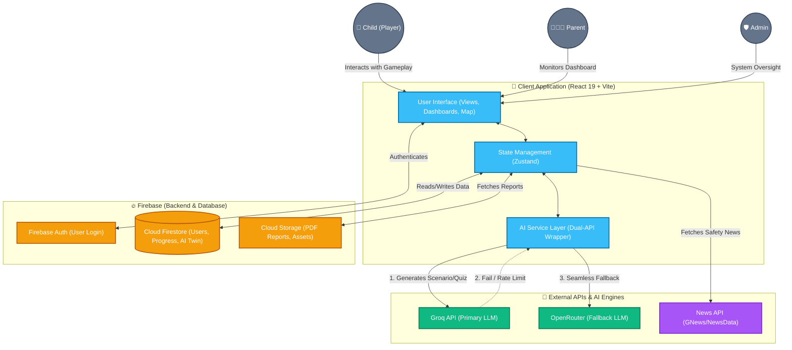

# RightsQuest Architecture Diagram

Here is a high-level system architecture diagram for **RightsQuest**. It visualizes the flow of data between the frontend application, the Firebase backend, and the AI/Third-party services.

### Key Components Explained:

1. **Client Application:** Built with React 19 and Vite. The UI interacts with a centralized state managed by `Zustand`. All complex AI API calls are intercepted by the **AI Service Layer**.
2. **Firebase Backend:** Entirely serverless. It handles secure authentication (`Auth`), NoSQL data storage for user progress and AI Safety Twin profiles (`Firestore`), and binary/file storage (`Storage`).
3. **External APIs (The "Brain"):** The system relies heavily on the **Groq API** for ultra-fast LLaMa-3.1 generations. If Groq goes down or hits rate limits, the AI Service Layer instantly catches the error and reroutes the exact prompt to **OpenRouter** to ensure the child never experiences a "loading failed" screen. News APIs are called directly to populate dashboards with real-world context.
