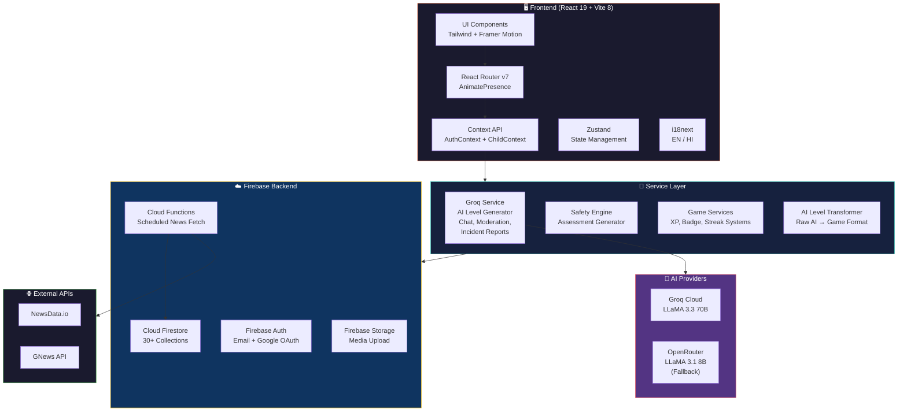
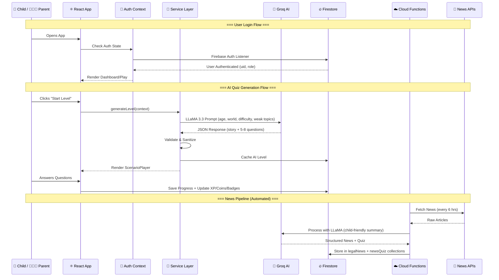
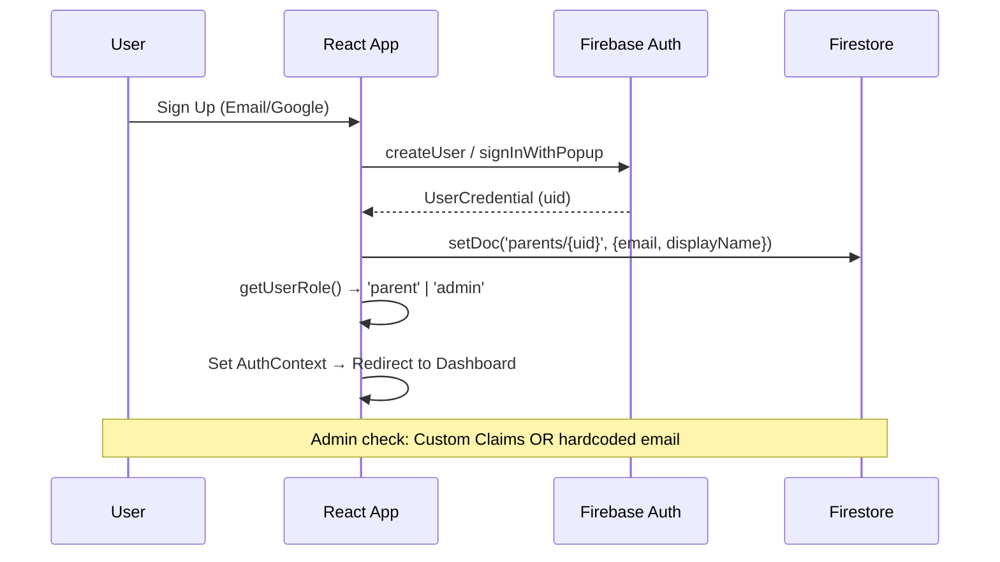
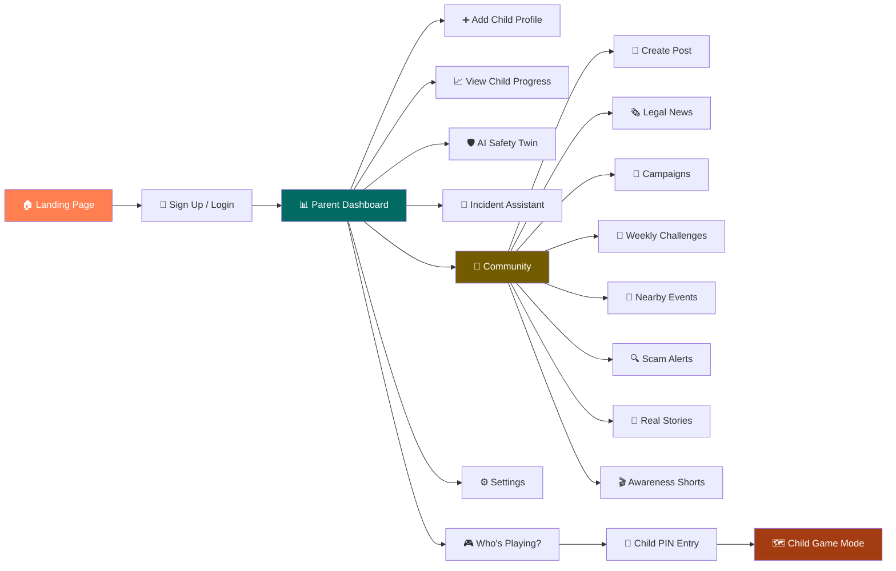
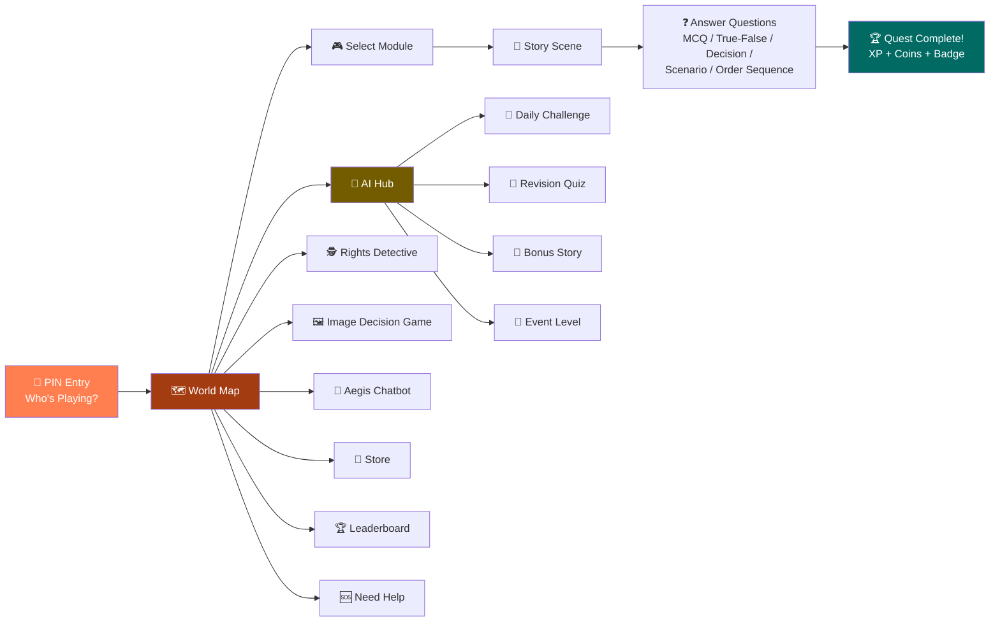
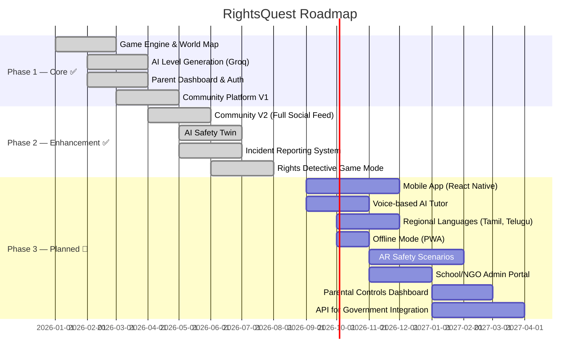

<p align="center">
  
  
  
  
  
  
  
</p>

<h1 align="center">🛡️ RightsQuest</h1>
<p align="center"><em>Learn Your Rights, One Quest at a Time 🎮⚖️</em></p>

<p align="center">
  A <strong>gamified, AI-powered legal literacy platform</strong> for Indian children aged 8–16 and their parents.<br/>
  Built for <strong>Smart India Hackathon (SIH) 2026</strong> — empowering the next generation with knowledge of their rights through interactive quests, AI-driven scenarios, community engagement, and real-time safety tools.
</p>

---

## 📑 Table of Contents

- [🌟 Project Overview](#-project-overview)
- [✨ Key Features](#-key-features)
- [🛠️ Tech Stack](#️-tech-stack)
- [🏗️ Architecture Overview](#️-architecture-overview)
- [🔁 Data Flow Diagram](#-data-flow-diagram)
- [📡 API Architecture](#-api-architecture)
- [🎮 How the App Works — User Journey](#-how-the-app-works--user-journey)
- [📂 Folder Structure](#-folder-structure)
- [🗄️ Database Schema](#️-database-schema)
- [⚙️ Setup & Installation Guide](#️-setup--installation-guide)
- [🚀 Deployment](#-deployment)
- [📸 Screenshots / Demo](#-screenshots--demo)
- [🗺️ Future Scope / Roadmap](#️-future-scope--roadmap)
- [🤝 Contributing](#-contributing)
- [📄 License](#-license)

---

## 🌟 Project Overview

| | |
|---|---|
| **Project Name** | RightsQuest |
| **Tagline** | *Learn Your Rights, One Quest at a Time* |
| **Problem Statement** | Millions of Indian children lack awareness about their fundamental rights, child protection laws, cyber safety, and emergency procedures — leaving them vulnerable. |
| **Solution** | A gamified learning platform that teaches legal literacy through interactive story-based quests, AI-generated scenarios, community engagement, real-time incident reporting, and a parent-facing safety dashboard. |
| **Target Users** | 👧👦 Children aged 8–16 • 👨‍👩‍👧 Parents & Guardians • 🏫 Educators • 🏛️ Admins & NGOs |
| **Built For** | 🇮🇳 Smart India Hackathon (SIH) 2026 |

---

## ✨ Key Features

### 🎮 For Children
| Feature | Description |
|---------|-------------|
| 🗺️ **World Map & Quest System** | 5 themed worlds — Child Rights Island, Cyber Guardian, Girls Safety Shield, Self Defence Academy, Legal Hero — each with progressive levels |
| 🤖 **AI-Generated Levels** | Groq LLaMA-3.3 dynamically generates quiz scenarios tailored to child's age, difficulty, weak topics & language |
| 📅 **Daily Challenges** | Unique AI-crafted challenges every day with streak tracking & bonus rewards |
| 🕵️ **Rights Detective** | Investigate real-life legal scenarios, gather clues, solve puzzles and learn laws interactively |
| 🖼️ **Image Decision Game** | Visual scenario-based game where children identify safe vs unsafe situations |
| 💬 **Aegis AI Chatbot** | Friendly safety guardian chatbot (Hinglish/English) for children to ask about rights, safety, and report concerns |
| 🏪 **Store & Avatars** | Earn coins to unlock avatars and titles |
| 🏆 **Leaderboard & Badges** | Global leaderboard, XP system with 13 levels (Beginner → Legend), achievement badges |
| 📜 **AI Certificates** | Personalized digital certificates generated by AI on world completion |
| 🆘 **Need Help / Get Help** | AI-powered SOS system — children can report incidents and get immediate, empathetic guidance |

### 👨‍👩‍👧 For Parents
| Feature | Description |
|---------|-------------|
| 📊 **Parent Dashboard** | Manage children profiles, view progress, XP, streaks, and badges at a glance |
| 🛡️ **AI Safety Twin** | AI-powered digital twin that continuously analyzes child's learning data and provides personalized safety assessments, risk indicators, and weekly reports |
| 🚨 **Incident Assistant** | Guided AI-driven incident reporting tool with risk assessment, do's/don'ts, emergency numbers, and official reporting options |
| 💬 **Legal AI Chat** | Chat with an AI legal assistant that provides Indian law references, actionable steps, and emergency numbers |
| 🏘️ **Community Platform** | Full-featured social platform — create posts, share stories, join campaigns, weekly challenges, nearby events, scam alerts, myth busters, awareness shorts, legal news feed |
| 🔔 **Notifications** | Real-time notifications for likes, comments, and child help requests |
| ⚙️ **Settings** | Profile management, language switching (English/Hindi), theme preferences, feedback |

### 🔐 For Admins
| Feature | Description |
|---------|-------------|
| 📋 **Admin Dashboard** | Platform analytics — total users, active children, modules, community posts |
| 📚 **Module Manager** | CRUD operations for game modules and scenes |
| 🛡️ **Moderation Queue** | AI-assisted content moderation for community posts and stories |
| 📩 **Support Requests** | Manage child support/help requests |
| 💬 **Feedback Table** | View all user feedback with ratings |
| 🏥 **Help Services Manager** | CRUD for help services (NGOs, helplines, legal aid) with geo-location data |

---

## 🛠️ Tech Stack

### Frontend

| Technology | Purpose |
|------------|---------|
|  | UI Library |
|  | Type Safety |
|  | Build Tool & Dev Server |
|  | Utility-First CSS |
|  | Page Transitions & Animations |
|  | Client-side Routing |
|  | State Management |
|  | Internationalization (EN/HI) |
|  | Data Visualization |
|  | Icon Library |
|  | Form Management |

### Backend & Infrastructure

| Technology | Purpose |
|------------|---------|
|  | Authentication (Email/Password + Google OAuth) |
|  | NoSQL Database (30+ collections) |
|  | Media File Storage |
|  | Serverless Backend (Scheduled News Fetcher) |

### AI / ML

| Technology | Purpose |
|------------|---------|
|  | Primary AI Engine (LLaMA 3.3 70B Versatile) |
|  | AI Fallback Engine (LLaMA 3.1 8B) |

### External APIs

| API | Purpose |
|-----|---------|
|  | Legal News Fetching (Primary) |
|  | Legal News Fetching (Fallback) |

### Dev Tools

| Tool | Purpose |
|------|---------|
|  | Fast Linter |
|  | CSS Processing |

---

## 🏗️ Architecture Overview



### Component Breakdown

| Component | Technology | Responsibility |
|-----------|-----------|----------------|
| **Frontend SPA** | React 19 + TypeScript | Renders UI, handles routing, manages state, lazy-loads 35+ pages |
| **Auth Layer** | Firebase Auth | Email/Password & Google OAuth sign-up/sign-in, role-based access (Parent/Admin) |
| **Database** | Cloud Firestore | 30+ collections for users, game data, community, AI cache, incidents, news |
| **Storage** | Firebase Storage | Community post images, story media uploads |
| **AI Engine** | Groq (LLaMA 3.3 70B) | Dynamic quiz generation, chatbot, moderation, safety assessments, incident reports, certificates |
| **AI Fallback** | OpenRouter (LLaMA 3.1 8B) | Automatic failover when Groq is unavailable |
| **Cloud Functions** | Firebase Functions (Node 18) | Scheduled news fetching every 6 hours, AI-powered news processing |
| **News Pipeline** | NewsData.io + GNews | Fetches India-focused legal/safety news → AI processes → stores in Firestore |

---

## 🔁 Data Flow Diagram



---

## 📡 API Architecture

### AI Service Endpoints (Client-Side via Groq SDK)

RightsQuest uses a **client-side AI service** (`groqService.ts`) that directly communicates with the Groq Cloud API. There is no traditional REST backend — Firebase serves as the BaaS (Backend as a Service).

<details>
<summary><strong>🤖 AI Service Methods (Click to expand)</strong></summary>

| # | Method | AI Model | Purpose | Input | Output |
|---|--------|----------|---------|-------|--------|
| 1 | `generateLevel()` | LLaMA 3.3 70B | Generate a playable quiz level | `LevelContext` (age, world, difficulty, weak topics) | `AIGeneratedLevel` (story + 5-8 questions + rewards) |
| 2 | `generateCampaignLevel()` | LLaMA 3.3 70B | Generate level for a campaign | Module title, category, difficulty, age | `AIGeneratedLevel` |
| 3 | `generateDailyChallenge()` | LLaMA 3.3 70B | Generate unique daily challenge | Context + recent daily topics | `AIGeneratedLevel` |
| 4 | `generateRevisionQuiz()` | LLaMA 3.3 70B | Generate revision for weak topics | Context + weak topics array | `AIGeneratedLevel` |
| 5 | `generateBonusStory()` | LLaMA 3.3 70B | Bonus story level on topic completion | Context + completed topic | `AIGeneratedLevel` |
| 6 | `generateEventLevel()` | LLaMA 3.3 70B | Special event level (Republic Day, etc.) | Context + event key | `AIGeneratedLevel` |
| 7 | `generatePractice()` | LLaMA 3.3 70B | Practice session on specific topic | Context + topic | `AIGeneratedLevel` |
| 8 | `moderateCommunityPost()` | LLaMA 3.1 8B | AI moderation of posts | Title, description, tags | `{ isSafe, reason, suggestedTags }` |
| 9 | `moderateStory()` | LLaMA 3.1 8B | AI moderation of real stories | Title, content, story type | `{ isSafe, reason }` |
| 10 | `answerLegalQuestion()` | LLaMA 3.3 70B | Legal AI chatbot for parents | Question + conversation history | `{ answer, emergencyNumbers, relatedTopics }` |
| 11 | `chatWithChild()` | LLaMA 3.3 70B | Aegis chatbot for children | Message + conversation history | `{ answer }` (Hinglish) |
| 12 | `generateIncidentAdvice()` | LLaMA 3.3 70B | Quick incident advice | Report context | `{ suggestion, actionableSteps }` |
| 13 | `generateIncidentReport()` | LLaMA 3.1 8B | Full incident report (Parent/Child mode) | Concern + chat history + mode | Full report with risk level, steps, resources |
| 14 | `generateSafetyAssessment()` | LLaMA 3.1 8B | AI safety analysis for Safety Twin | Child name, topic data, accuracy | `{ insights, recommendations, riskIndicators }` |
| 15 | `generateCertificateContent()` | LLaMA 3.3 70B | Personalized certificate text | Child name, age, cert type | `{ title, description, learningSummary, skills }` |
| 16 | `generateChildHelpSuggestion()` | LLaMA 3.3 70B | Empathetic help response for child | Category + message | `{ suggestion, actionableSteps }` |
| 17 | `analyzeLearningHistory()` | LLaMA 3.1 8B | Update Safety Twin profile | Learning events + current profile | Updated `SafetyTwinProfile` |
| 18 | `generateWeeklyReport()` | LLaMA 3.1 8B | Weekly report for parents | Events + profile | `AIReport` |

</details>

### Cloud Functions (Serverless Backend)

| Endpoint | Trigger | Purpose |
|----------|---------|---------|
| `scheduledNewsFetch` | Pub/Sub — every 6 hours | Fetches legal news from NewsData.io/GNews → processes with Groq AI → stores in Firestore |
| `manualNewsFetch` | HTTP GET/POST | Manual trigger for testing the news pipeline |

### Authentication Flow



### Error Handling Strategy

| Layer | Strategy |
|-------|----------|
| **AI Service** | 3 retry attempts → Groq (attempts 1-3) → OpenRouter fallback (attempt 4) |
| **Firestore** | `onSnapshot` error callbacks return empty arrays to prevent UI crashes |
| **Auth** | `ErrorBoundary` wraps entire app; toast notifications for auth errors |
| **Forms** | `react-hook-form` validation with user-friendly error messages |

### Sample AI Request / Response

<details>
<summary><strong>📤 Request — Generate Level</strong></summary>

```json
{
  "model": "llama-3.3-70b-versatile",
  "messages": [
    {
      "role": "system",
      "content": "You are an educational game content generator for RightsQuest..."
    },
    {
      "role": "user",
      "content": "Generate a playable educational level.\n\nPLAYER PROFILE:\n- Age Group: 8-11\n- Current World: 2 (Cyber Guardian)\n- Current Level: 3\n- Difficulty: Medium\n- Weak Topics: Digital Privacy, Phishing\n- Language: en\n\nREQUIREMENTS:\n- Generate exactly 5 to 8 unique questions\n- Mix at least 3 different question types"
    }
  ],
  "temperature": 0.7,
  "max_tokens": 4096,
  "response_format": { "type": "json_object" }
}
```
</details>

<details>
<summary><strong>📥 Response — Generated Level</strong></summary>

```json
{
  "world": "Cyber Guardian",
  "level": 3,
  "title": "The Phishing Trap",
  "story": "Arjun, a 10-year-old from Mumbai, receives an exciting message...",
  "difficulty": "Medium",
  "estimatedTime": "8 minutes",
  "learningObjective": "Learn to identify phishing attempts and protect personal data",
  "questions": [
    {
      "type": "scenario",
      "question": "Arjun receives an email saying he won ₹10,000 and needs to click a link...",
      "options": ["Click the link immediately", "Tell a trusted adult", "Reply with bank details", "Ignore and delete"],
      "correctAnswer": "Tell a trusted adult",
      "explanation": "Never click suspicious links. Under the IT Act 2000, Section 66D...",
      "legalFact": "IT Act 2000, Section 66D: Punishment for cheating by personation using computer resource",
      "xp": 20
    }
  ],
  "reward": { "coins": 100, "xp": 250, "badge": "Cyber Detective" }
}
```
</details>

---

## 🎮 How the App Works — User Journey

### 👨‍👩‍👧 Parent Journey



### 👧 Child Journey



### Page Route Map

| Route | Page | Access | Description |
|-------|------|--------|-------------|
| `/` | Home | Public | Landing page with features, CTA |
| `/signup` | Signup | Public | Email or Google sign-up |
| `/login` | Login | Public | Email or Google login |
| `/forgot-password` | Forgot Password | Public | Password reset via email |
| `/dashboard` | Dashboard | Parent | Parent dashboard with children overview |
| `/dashboard/add-child` | Add Child | Parent | Add a new child profile |
| `/dashboard/edit-child/:childId` | Edit Child | Parent | Edit existing child |
| `/dashboard/safety-twin/:childId` | AI Safety Twin | Parent | AI-powered safety assessment dashboard |
| `/community` | Community | Parent | Full community platform |
| `/incident-assistant` | Incident Assistant | Parent | AI-guided incident reporting |
| `/notifications` | Notifications | Parent | Real-time notification center |
| `/settings` | Settings | Parent | Profile, language, theme settings |
| `/play` | Who's Playing | Parent | Select which child is playing |
| `/play/:childId/map` | World Map | Child | Game world map with 5 worlds |
| `/play/:childId/module/:moduleId` | Scenario Player | Child | Play a game module |
| `/play/:childId/module/:moduleId/complete` | Quest Complete | Child | Level completion celebration |
| `/play/:childId/ai-hub` | AI Hub | Child | Access AI-generated levels |
| `/play/:childId/ai-level/:aiLevelId` | AI Level Player | Child | Play an AI-generated level |
| `/play/:childId/daily-quiz` | Daily Quiz | Child | Today's daily challenge |
| `/play/:childId/detective` | Rights Detective Home | Child | Case selection for detective mode |
| `/play/:childId/detective/:caseId` | Rights Detective Case | Child | Play a detective case |
| `/play/:childId/image-decision` | Image Decision Game | Child | Visual safety game |
| `/play/:childId/chat` | Aegis Chatbot | Child | AI chatbot for children |
| `/play/:childId/progress` | Child Progress | Child | XP, badges, stats |
| `/play/:childId/store` | Store | Child | Buy avatars & titles with coins |
| `/play/:childId/leaderboard` | Leaderboard | Child | Global XP leaderboard |
| `/play/:childId/get-help` | Get Help | Child | Safety resources & helplines |
| `/play/:childId/need-help` | Need Help | Child | Report an incident / ask for help |
| `/admin-login` | Admin Login | Public | Admin authentication |
| `/admin` | Admin Dashboard | Admin | Platform stats overview |
| `/admin/modules` | Module Manager | Admin | CRUD for game modules |
| `/admin/moderation` | Moderation Queue | Admin | Content moderation |
| `/admin/support-requests` | Support Requests | Admin | Manage help requests |
| `/admin/feedback` | Feedback Table | Admin | View platform feedback |
| `/admin/help-services` | Help Services Manager | Admin | Manage helpline/NGO directory |
| `/privacy` | Privacy Policy | Public | Privacy policy page |
| `/terms` | Terms of Service | Public | ToS page |

### State Management

| Tool | Scope | Usage |
|------|-------|-------|
| **React Context** (`AuthContext`) | Global | Firebase Auth state, user role, loading state |
| **React Context** (`ChildContext`) | Global | Active child profile in game mode |
| **Zustand** | Component-level | Local component state management |
| **React Hook Form** | Forms | Form state, validation, submission |
| **Firestore `onSnapshot`** | Real-time | Community posts, notifications, news, events (live subscriptions) |

---

## 📂 Folder Structure

```
rightsquest/
├── 📄 index.html                    # Entry HTML file
├── 📄 package.json                  # Frontend dependencies & scripts
├── 📄 vite.config.ts                # Vite build configuration
├── 📄 tailwind.config.js            # Tailwind CSS theme (Material 3 design tokens)
├── 📄 postcss.config.js             # PostCSS config for Tailwind
├── 📄 tsconfig.json                 # TypeScript root config
├── 📄 tsconfig.app.json             # App-specific TS config
├── 📄 tsconfig.node.json            # Node-specific TS config
├── 📄 .oxlintrc.json                # OxLint linter config
├── 📄 firestore.rules               # Firestore security rules (30+ collection rules)
├── 📄 .env                          # Environment variables (Firebase, Groq, News APIs)
├── 📄 .gitignore                    # Git ignore rules
│
├── 📁 public/                       # Static assets
│   ├── 📄 favicon.svg               # App favicon
│   ├── 📄 icons.svg                 # SVG icon sprites
│   └── 📁 assets/                   # Public images and assets
│
├── 📁 src/                          # Source code
│   ├── 📄 main.tsx                  # React entry point
│   ├── 📄 App.tsx                   # Root component — routing, providers, lazy loading
│   ├── 📄 index.css                 # Global CSS + Tailwind imports
│   ├── 📄 i18n.ts                   # i18next internationalization setup (EN/HI)
│   │
│   ├── 📁 pages/                    # Route-level page components (35+ pages)
│   │   ├── 📄 Home.tsx              # Landing page
│   │   ├── 📄 Signup.tsx            # User registration
│   │   ├── 📄 Login.tsx             # User login
│   │   ├── 📄 ForgotPassword.tsx    # Password reset
│   │   ├── 📄 Dashboard.tsx         # Parent dashboard
│   │   ├── 📄 AddChild.tsx          # Add/edit child profile
│   │   ├── 📄 WhosPlaying.tsx       # Child selection screen
│   │   ├── 📄 WorldMap.tsx          # Game world map (5 worlds)
│   │   ├── 📄 ScenarioPlayer.tsx    # Main game scene player
│   │   ├── 📄 QuestComplete.tsx     # Level completion screen
│   │   ├── 📄 AIHub.tsx             # AI-generated levels hub
│   │   ├── 📄 AILevelPlayer.tsx     # Play AI-generated levels
│   │   ├── 📄 AIQuestComplete.tsx   # AI level completion
│   │   ├── 📄 DailyQuizPage.tsx     # Daily challenge page
│   │   ├── 📄 ChildChatBot.tsx      # Aegis AI chatbot for children
│   │   ├── 📄 ChildProgress.tsx     # Child stats & achievements
│   │   ├── 📄 ImageDecisionGame.tsx # Visual decision game
│   │   ├── 📄 RightsDetectiveHome.tsx # Detective case selection
│   │   ├── 📄 RightsDetectiveCase.tsx # Play detective cases
│   │   ├── 📄 IncidentAssistant.tsx # AI incident reporting
│   │   ├── 📄 Community.tsx         # Parent community platform
│   │   ├── 📄 Store.tsx             # In-game store
│   │   ├── 📄 Leaderboard.tsx       # Global leaderboard
│   │   ├── 📄 MultiplayerLobby.tsx  # Multiplayer lobby
│   │   ├── 📄 GetHelp.tsx           # Help resources
│   │   ├── 📄 NeedHelp.tsx          # Child SOS / help form
│   │   ├── 📄 Notifications.tsx     # Notification center
│   │   ├── 📄 Settings.tsx          # User settings
│   │   ├── 📄 AdminLogin.tsx        # Admin login page
│   │   ├── 📄 NotFound.tsx          # 404 page
│   │   ├── 📄 PrivacyPolicy.tsx     # Privacy policy
│   │   ├── 📄 TermsOfService.tsx    # Terms of service
│   │   ├── 📁 admin/                # Admin pages
│   │   │   ├── 📄 AdminDashboard.tsx
│   │   │   ├── 📄 ModuleManager.tsx
│   │   │   ├── 📄 ModerationQueue.tsx
│   │   │   ├── 📄 SupportRequests.tsx
│   │   │   ├── 📄 FeedbackTable.tsx
│   │   │   └── 📄 HelpServicesManager.tsx
│   │   └── 📁 Parent/               # Parent-specific pages
│   │       └── 📄 AISafetyTwinDashboard.tsx
│   │
│   ├── 📁 components/               # Reusable UI components
│   │   ├── 📄 ErrorBoundary.tsx     # Global error boundary
│   │   ├── 📄 RouteGuards.tsx       # ProtectedRoute, AdminRoute, PublicRoute
│   │   ├── 📁 ui/                   # Base UI kit (11 components)
│   │   │   ├── 📄 Button.tsx
│   │   │   ├── 📄 Input.tsx
│   │   │   ├── 📄 Modal.tsx
│   │   │   ├── 📄 PinInput.tsx
│   │   │   ├── 📄 ProgressBar.tsx
│   │   │   ├── 📄 SkeletonLoader.tsx
│   │   │   ├── 📄 StarRating.tsx
│   │   │   ├── 📄 EmptyState.tsx
│   │   │   ├── 📄 LanguageSwitcher.tsx
│   │   │   ├── 📄 HelpRequestToast.tsx
│   │   │   └── 📄 AIMentorWidget.tsx
│   │   ├── 📁 community/            # Community platform components (17+)
│   │   │   ├── 📄 PostCard.tsx
│   │   │   ├── 📄 CreatePostModal.tsx
│   │   │   ├── 📄 CommentsModal.tsx
│   │   │   ├── 📄 CategoryChip.tsx
│   │   │   ├── 📄 CampaignCarousel.tsx
│   │   │   ├── 📄 WeeklyChallengeCard.tsx
│   │   │   ├── 📄 NearbyEventsSection.tsx
│   │   │   ├── 📄 DailyNewsSection.tsx
│   │   │   ├── 📄 LegalAIChat.tsx
│   │   │   ├── 📄 MythFactCards.tsx
│   │   │   ├── 📄 RealStoriesSection.tsx
│   │   │   ├── 📄 ScamAlertSection.tsx
│   │   │   ├── 📄 AwarenessShortsSection.tsx
│   │   │   ├── 📄 InlineFeedQuiz.tsx
│   │   │   ├── 📄 VerifiedBadge.tsx
│   │   │   ├── 📄 XPRewardPopup.tsx
│   │   │   ├── 📄 SkeletonFeed.tsx
│   │   │   └── 📁 news/             # News sub-components
│   │   ├── 📁 dashboard/            # Dashboard components
│   │   │   └── 📄 SafetyAnalytics.tsx
│   │   └── 📁 game/                 # Game-specific components
│   │       ├── 📄 DailyChallengeCard.tsx
│   │       └── 📁 rights-detective/  # Detective game components
│   │
│   ├── 📁 layouts/                  # Layout wrappers (navigation, sidebars)
│   │   ├── 📄 ParentLayout.tsx      # Parent mode layout (sidebar + header)
│   │   ├── 📄 ChildLayout.tsx       # Child game mode layout (bottom nav)
│   │   └── 📄 AdminLayout.tsx       # Admin panel layout (sidebar)
│   │
│   ├── 📁 contexts/                 # React Context providers
│   │   ├── 📄 AuthContext.tsx       # Firebase auth state & user role
│   │   └── 📄 ChildContext.tsx      # Active child profile state
│   │
│   ├── 📁 firebase/                 # Firebase service layer
│   │   ├── 📄 config.ts             # Firebase app initialization
│   │   ├── 📄 auth.ts               # Auth methods (signup, login, Google, logout, role check)
│   │   ├── 📄 firestore.ts          # Firestore CRUD (parents, children, modules, progress, etc.)
│   │   ├── 📄 communityFirestore.ts # Community-specific Firestore operations (900+ lines)
│   │   └── 📄 storage.ts            # Firebase Storage upload/delete
│   │
│   ├── 📁 services/                 # Business logic & AI services
│   │   ├── 📄 groqService.ts        # 🧠 Core AI engine — 18 methods, 970 lines
│   │   ├── 📄 safetyEngine.ts       # Safety assessment generator
│   │   ├── 📄 aiLevelTransformer.ts # Transforms AI output → game-ready format
│   │   ├── 📄 xpSystem.ts           # XP calculation & level progression
│   │   ├── 📄 badgeSystem.ts        # Badge eligibility checker
│   │   └── 📄 streakSystem.ts       # Login streak calculator
│   │
│   ├── 📁 types/                    # TypeScript type definitions
│   │   └── 📄 index.ts              # 995 lines — 60+ interfaces & types
│   │
│   ├── 📁 hooks/                    # Custom React hooks
│   │   └── 📄 useGameData.ts        # Game data loading hook
│   │
│   ├── 📁 utils/                    # Utility functions
│   │   ├── 📄 index.ts              # Helper functions
│   │   ├── 📄 avatar.ts             # Avatar URL generator
│   │   └── 📄 mapGenerator.ts       # World map position generator
│   │
│   ├── 📁 data/                     # Static game data
│   │   ├── 📄 index.ts              # Data exports
│   │   ├── 📄 seed.ts               # Database seeding data
│   │   ├── 📄 world1.ts             # Child Rights Island — modules & scenes
│   │   ├── 📄 world2.ts             # Cyber Guardian — modules & scenes
│   │   ├── 📄 world3.ts             # Girls Safety Shield — modules & scenes
│   │   ├── 📄 world4.ts             # Self Defence Academy — modules & scenes
│   │   ├── 📄 world5.ts             # Legal Hero — modules & scenes
│   │   ├── 📄 imageDecisions.ts     # Image decision game rounds
│   │   ├── 📄 rightsDetectiveCases.ts # Detective case data (27KB)
│   │   ├── 📁 categories/           # Community category definitions
│   │   └── 📁 locales/              # Locale-specific data
│   │
│   ├── 📁 translations/             # i18n translation files
│   │   ├── 📄 en.json               # English translations (22KB)
│   │   └── 📄 hi.json               # Hindi translations (43KB)
│   │
│   ├── 📁 constants/                # App-wide constants
│   │   └── 📄 index.ts              # Mascot URL, world configs, etc.
│   │
│   ├── 📁 animations/               # Framer Motion animation variants
│   │   └── 📄 variants.ts           # Reusable animation presets
│   │
│   └── 📁 scripts/                  # Build/seed scripts
│       ├── 📄 fetchNews.ts          # Manual news fetcher script
│       ├── 📄 seedCommunity.ts      # Seed community data
│       ├── 📄 seedCompleteGame.ts   # Seed game modules
│       ├── 📄 seedHelpServices.ts   # Seed help services
│       ├── 📄 seedNewsAPI.ts        # Seed news data
│       ├── 📄 clearNews.ts          # Clear news collection
│       └── 📄 translateGameData.ts  # Auto-translate game data
│
├── 📁 functions/                    # Firebase Cloud Functions
│   ├── 📄 package.json              # Functions dependencies
│   ├── 📄 tsconfig.json             # Functions TS config
│   └── 📁 src/
│       ├── 📄 index.ts              # Function exports (scheduled + HTTP)
│       ├── 📄 newsFetcher.ts        # News fetching pipeline (NewsData + GNews)
│       └── 📄 groqProcessor.ts      # AI processing for news articles
│
└── 📁 dist/                         # Production build output
```

---

## 🗄️ Database Schema

RightsQuest uses **Cloud Firestore** (NoSQL document database) with **30+ collections**.

### ER Diagram

```mermaid
erDiagram
    PARENTS ||--o{ CHILDREN : has
    PARENTS ||--o{ COMMUNITY_POSTS : creates
    PARENTS ||--o{ INCIDENT_REPORTS : files
    PARENTS ||--o{ CERTIFICATES : receives
    PARENTS ||--o{ CHAT_SESSIONS : owns
    CHILDREN ||--o{ PROGRESS : tracks
    CHILDREN ||--o{ DETECTIVE_PROGRESS : tracks
    CHILDREN ||--o{ AI_LEVEL_CACHE : generates
    CHILDREN ||--o{ CHALLENGE_STREAKS : maintains
    MODULES ||--o{ SCENES : contains
    COMMUNITY_POSTS ||--o{ COMMENTS : has
    COMMUNITY_POSTS ||--o{ LIKES : has
    COMMUNITY_POSTS ||--o{ REPORTS : receives
    CAMPAIGNS ||--o{ CAMPAIGN_PARTICIPATIONS : has
    WEEKLY_CHALLENGES ||--o{ WEEKLY_CHALLENGE_PROGRESS : tracks
    NEARBY_EVENTS ||--o{ EVENT_REGISTRATIONS : has
    LEGAL_NEWS ||--o{ NEWS_READ_STATUS : tracks
    LEGAL_NEWS ||--o{ NEWS_QUIZ : has
    REAL_STORIES ||--o{ STORY_LIKES : has
    REAL_STORIES ||--o{ STORY_COMMENTS : has
    SCAM_ALERTS ||--o{ SCAM_ALERT_INTERACTIONS : tracks
    AWARENESS_SHORTS ||--o{ SHORT_INTERACTIONS : tracks
    FEED_QUIZZES ||--o{ FEED_QUIZ_ATTEMPTS : has

    PARENTS {
        string id PK
        string email
        string displayName
        string pin
        timestamp createdAt
    }

    CHILDREN {
        string id PK
        string parentId FK
        string displayName
        string avatarId
        string ageGroup "8-11 | 12-16"
        string pinHash
        int xp
        int level
        int coins
        int streak
        int highestStreak
        string languagePref "en | hi"
        int safetyScore
        object safetyTwinProfile
        array learningEvents
        array aiReports
    }

    MODULES {
        string id PK
        string title
        string description
        string category
        string difficulty "Easy | Medium | Hard | Boss"
        int estimatedMinutes
        string ageRange
        int order
        int xpReward
        int coinReward
        string coverImageUrl
    }

    SCENES {
        string id PK
        string moduleId FK
        string type "story | choice | spot_danger | time_challenge | drag_drop | match_pair | order_sequence | puzzle | conversation | image_decision"
        string text
        array choices
        int order
    }

    PROGRESS {
        string id PK "parentId_childId_moduleId"
        string parentId FK
        string childId FK
        string moduleId FK
        int score
        string status "in_progress | completed"
        object categoryScores
        int timeSpent
        float accuracy
    }

    AI_LEVEL_CACHE {
        string id PK
        string childId FK
        string parentId FK
        string type "bonus_story | daily_challenge | revision | practice | event"
        object levelData
        string status "unplayed | in_progress | completed"
        timestamp generatedAt
    }
```



### Collections Overview

<details>
<summary><strong>📋 Complete Collections List (30+ collections)</strong></summary>

| # | Collection | Description | Key Fields |
|---|-----------|-------------|------------|
| 1 | `parents` | Parent/guardian accounts | email, displayName, pin, createdAt |
| 2 | `parents/{id}/children` | Child profiles (subcollection) | displayName, avatarId, ageGroup, xp, level, coins, streak, safetyTwinProfile |
| 3 | `modules` | Game learning modules | title, category, difficulty, ageRange, order, xpReward |
| 4 | `modules/{id}/scenes` | Interactive scenes per module | type, text, choices, dangerZones, timeLimit |
| 5 | `progress` | Child learning progress | parentId, childId, moduleId, score, status, accuracy |
| 6 | `badges` | Achievement badges | title, iconUrl, criteriaType, criteriaValue |
| 7 | `communityPosts` | Parent community posts | authorId, title, description, category, likesCount, commentsCount |
| 8 | `communityComments` | Comments on posts | postId, authorId, text, likesCount |
| 9 | `communityLikes` | Post likes | postId, userId |
| 10 | `communityBookmarks` | Polymorphic bookmarks | userId, contentType, contentId |
| 11 | `notifications` | User notifications | userId, actorId, type, postId, read |
| 12 | `campaigns` | Awareness campaigns | title, categoryId, rewardXP, quizQuestions, learningResources |
| 13 | `campaignParticipations` | Campaign participation tracking | campaignId, userId, completedTasks, quizScore |
| 14 | `weeklyChallenges` | Weekly challenges | title, tasks, rewardXP, status |
| 15 | `weeklyChallengeProgress` | Challenge progress per user | challengeId, userId, taskProgress, completed |
| 16 | `nearbyEvents` | Safety workshops & events | title, type, location, latitude, longitude, date, organizerName |
| 17 | `eventRegistrations` | Event registrations | eventId, userId |
| 18 | `chatSessions` | Legal AI chat sessions | userId, messages[], title |
| 19 | `legalNews` | Processed legal news articles | title, summary, safetyTips, legalPoints, quiz, xpReward |
| 20 | `newsReadStatus` | News read tracking | newsId, userId, xpAwarded |
| 21 | `newsQuiz` | Quizzes attached to news | newsId, questions[], totalXP |
| 22 | `mythFacts` | Myth vs Fact cards | myth, fact, explanation, legalInfo, categoryId |
| 23 | `mythFactProgress` | Myth/fact completion tracking | mythFactId, userId, completed |
| 24 | `feedQuizzes` | Quizzes attached to feed posts | postId, questions[], rewardXP |
| 25 | `feedQuizAttempts` | Quiz attempt tracking | quizId, userId, score, xpAwarded |
| 26 | `awarenessShorts` | Short awareness videos | title, mediaUrl, mediaType, likesCount, viewsCount |
| 27 | `shortInteractions` | Short video interactions | shortId, userId, watched, liked, bookmarked |
| 28 | `realStories` | User-shared real stories | authorId, title, content, storyType, likesCount |
| 29 | `storyLikes` | Story likes | storyId, userId |
| 30 | `storyComments` | Story comments | postId, authorId, text |
| 31 | `verifiedUsers` | Verified experts/NGOs | userId, verifiedType, organization |
| 32 | `scamAlerts` | Scam alert cards | title, scamType, severity, howItWorks, howToStaySafe |
| 33 | `scamAlertInteractions` | Scam alert interactions | alertId, userId, read, quizCompleted |
| 34 | `supportRequests` | Child help/support requests | category, message, status, assignedOrgId |
| 35 | `organizations` | NGOs, Helplines, Legal Aid | name, type, verified, contactInfo |
| 36 | `feedback` | User feedback | parentId, rating, comments, screenContext |
| 37 | `aiLevelCache` | Cached AI-generated levels | childId, type, levelData, status, generatedAt |
| 38 | `childAssessment` | Safety assessment snapshots | childId, overallScore, topicScores, riskIndicators |
| 39 | `incidentReports` | Incident reports | parentId, initialConcern, riskLevel, immediateSteps |
| 40 | `challengeStreaks` | Daily challenge streak data | childId, currentStreak, highestStreak |
| 41 | `certificates` | Digital certificates | childId, type, certificateNumber, aiContent |
| 42 | `help_services` | Help service directory | organizationName, state, district, phone, latitude, longitude |
| 43 | `parents/{id}/children/{id}/detectiveProgress` | Detective case progress | caseId, status, cluesFound, puzzlesCompleted, score |

</details>

---

## ⚙️ Setup & Installation Guide

### Prerequisites

| Tool | Version | Purpose |
|------|---------|---------|
| **Node.js** | ≥ 18.x | Runtime |
| **npm** | ≥ 9.x | Package manager |
| **Git** | Latest | Version control |
| **Firebase CLI** | Latest | Cloud Functions deployment |

### Step 1: Clone the Repository

```bash
git clone https://github.com/ayushkrsingh001/SIH_2026.git
cd SIH_2026
```

### Step 2: Install Frontend Dependencies

```bash
npm install
```

### Step 3: Install Cloud Functions Dependencies

```bash
cd functions
npm install
cd ..
```

### Step 4: Configure Environment Variables

Create a `.env` file in the project root:

```env
# Firebase Configuration
VITE_FIREBASE_API_KEY=your_firebase_api_key
VITE_FIREBASE_AUTH_DOMAIN=your_project.firebaseapp.com
VITE_FIREBASE_PROJECT_ID=your_project_id
VITE_FIREBASE_STORAGE_BUCKET=your_project.firebasestorage.app
VITE_FIREBASE_MESSAGING_SENDER_ID=your_sender_id
VITE_FIREBASE_APP_ID=your_app_id
VITE_FIREBASE_MEASUREMENT_ID=your_measurement_id

# Groq AI Configuration (Primary AI Engine)
VITE_GROQ_API_KEY=your_groq_api_key

# OpenRouter AI (Fallback Engine)
VITE_OPENROUTER_API_KEY=your_openrouter_api_key

# News APIs (for Cloud Functions)
NEWSDATA_API_KEY=your_newsdata_api_key
GNEWS_API_KEY=your_gnews_api_key
```

### Step 5: Run Development Server

```bash
npm run dev
```

The app will be available at `http://localhost:5173`

### Step 6: (Optional) Seed the Database

```bash
# Seed game modules and scenes
npx vite-node src/scripts/seedCompleteGame.ts

# Seed community data
npx vite-node src/scripts/seedCommunity.ts

# Seed help services
npx vite-node src/scripts/seedHelpServices.ts

# Fetch and seed news
npm run fetch-news
```

### Step 7: (Optional) Deploy Cloud Functions

```bash
cd functions
npm run deploy
```

---

## 🚀 Deployment

| Service | Platform | Details |
|---------|----------|---------|
| **Frontend** | Firebase Hosting / Vercel / Netlify | `npm run build` → Deploy `dist/` folder |
| **Database** | Cloud Firestore | Auto-managed by Firebase |
| **Auth** | Firebase Auth | Auto-managed by Firebase |
| **Storage** | Firebase Storage | Auto-managed by Firebase |
| **Cloud Functions** | Firebase Functions (Node 18) | `firebase deploy --only functions` |
| **News Pipeline** | Scheduled Cloud Function | Runs every 6 hours automatically |

### Build for Production

```bash
# Build the frontend
npm run build

# Preview the production build locally
npm run preview
```

### CI/CD

> **Note:** CI/CD pipeline can be configured with GitHub Actions for automatic builds and deployments to Firebase Hosting on push to `main`.

---

## 📸 Screenshots / Demo

> 📌 **Add your screenshots and GIFs here!**

| Screen | Description |
|--------|-------------|
|  | *Landing page with hero section, features, and CTA* |
|  | *Parent dashboard showing children cards and stats* |
|  | *Interactive world map with 5 themed worlds* |
|  | *Story-based quiz gameplay with animations* |
|  | *AI-generated levels hub — daily challenge, revision, bonus* |
|  | *Full community platform with posts, news, campaigns* |
|  | *Child-friendly AI chatbot in Hinglish* |
|  | *AI Safety Twin dashboard with radar charts* |
|  | *AI-guided incident reporting wizard* |
|  | *Admin dashboard with module management* |

---

## 🗺️ Future Scope / Roadmap



### Upcoming Features

| Feature | Status | Description |
|---------|--------|-------------|
| 📱 **React Native App** | 🔮 Planned | Native mobile app for iOS & Android |
| 🎙️ **Voice AI Tutor** | 🔮 Planned | Voice-based interactions for younger children |
| 🌐 **Multi-language Support** | 🔮 Planned | Tamil, Telugu, Bengali, Marathi, Kannada |
| 📶 **Offline Mode (PWA)** | 🔮 Planned | Play without internet using Service Workers |
| 🥽 **AR Safety Scenarios** | 🔮 Planned | Augmented reality for immersive learning |
| 🏫 **School Admin Portal** | 🔮 Planned | Bulk student onboarding, classroom tracking |
| 👥 **Multiplayer Quizzes** | 🔮 Planned | Real-time multiplayer quiz battles |
| 🏛️ **Government API** | 🔮 Planned | Integration with NCPCR, WCD Ministry dashboards |
| 📊 **Advanced Analytics** | 🔮 Planned | ML-based predictive risk models for children |
| 🎖️ **Physical Certificates** | 🔮 Planned | QR-verifiable printed certificates for schools |

---

## 🤝 Contributing

We welcome contributions! Here's how to get started:

1. **Fork** the repository
2. **Create** a feature branch: `git checkout -b feature/amazing-feature`
3. **Commit** your changes: `git commit -m 'Add amazing feature'`
4. **Push** to the branch: `git push origin feature/amazing-feature`
5. **Open** a Pull Request

### Code Quality

```bash
# Run linter
npm run lint
```

---

## 📄 License

This project is built for **Smart India Hackathon (SIH) 2026**.

---

<p align="center">
  <strong>Built with ❤️ for India's children</strong><br/>
  <em>Empowering the next generation with knowledge of their rights 🇮🇳</em>
</p>

<p align="center">
  
  
  
  
</p>
